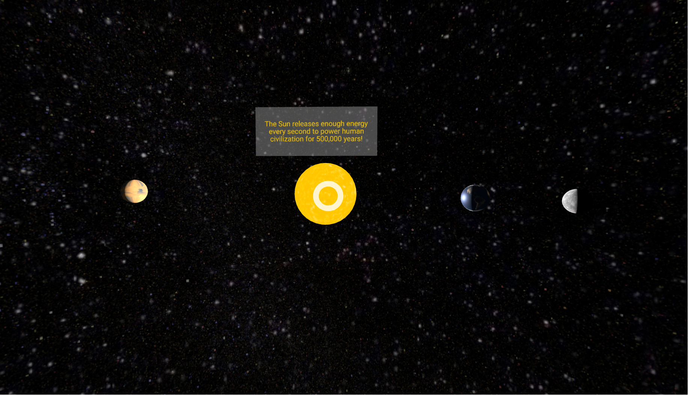

# 🌌 Solar System VR Animation

An interactive 3D Solar System experience built using **A-Frame**, featuring animated planetary orbits, immersive VR view, and informative click interactions.

## 🚀 Project Overview

This project simulates a small solar system in VR where users can:

- 🌞 Explore the Sun, Earth, Mars, and the Moon in 3D  
- 🪐 Observe animated orbits of every celestial body  
- 🖱️ Click on each celestial object to reveal interesting facts  
- 🎮 Experience camera movement and spatial depth with basic VR controls  

## 🛠 Technologies Used

- [A-Frame](https://aframe.io) - Web framework for building VR experiences  
- HTML + JavaScript  
- Publicly hosted texture assets (e.g., Glitch CDN)  

## 📂 How to Run

1. Clone or download this repository  
2. Open `Index.html` in a modern browser (preferably Chrome or Firefox)  
3. Use your mouse or VR headset to navigate the 3D environment  
4. Click on planets or the moon to view additional information  

> No installation or server required — runs fully in browser.

## 📸 Preview

## 📄 License

This project is provided for educational/demo purposes. Feel free to modify or share.